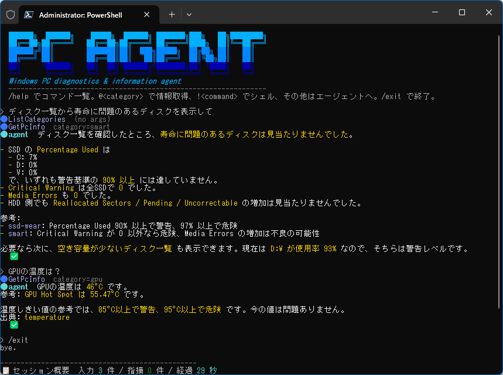

# 🖥️ PcAgent

Windows PC の情報取得・診断・修復を行うエージェント CLI。情報収集(ハードウェア/SMART/システム)、外部ルールによる決定的な診断、LLM との対話(ストリーミング)、承認付きの修復アクションを 1 つの TUI に統合する。



- **基盤**: .NET 10 / C# / [Smart.CommandLine.Hosting](https://www.nuget.org/packages/Usa.Smart.CommandLine.Hosting)
- **エージェント**: Microsoft Agent Framework (`Microsoft.Agents.AI`)
- **TUI**: [Spectre.Console](https://spectreconsole.net/) + [PrettyPrompt](https://github.com/waf/PrettyPrompt)（日本語優先・絵文字/進捗グラフ・桁ずれしないハイフン区切り）

## ✨ 主な機能

- **情報取得**: ハードウェア(CPU/GPU/メモリ/ディスク)・SMART・**Wi-Fi**・システム情報の収集（`ICollector` で拡張可能）。
- **診断**: 外部 JSON ルール/閾値による決定的な診断とダッシュボード表示（実行ごとに再読込）。
- **対話エージェント**: LLM とのストリーミング対話、ツール呼び出しの可視化、ナレッジ(RAG)注入、簡易マークダウン整形、会話メモリ（ターン間）+ 履歴自動圧縮。
- **REPL**: `/` コマンド・`@` 情報注入・`!` シェルのモード切替、補完(PrettyPrompt)、終了サマリ。
- **カスタムコマンド**: Markdown(frontmatter + `$ARGUMENTS`/`@`/`` !`cmd` ``)で `/コマンド` を追加。
- **修復アクション(HITL)**: 一時ファイル / bin・obj 削除、LLM シェル（許可リスト制）を承認付きで実行。
- **可観測性**: 処理時間ログ + OpenTelemetry トレース/OTLP（既定オフ）。
- **配布**: 自己完結・単一ファイル(Trimming なし)発行。

### 🤖 使用している Microsoft Agent Framework 機能

Microsoft Agent Framework（`Microsoft.Agents.AI` 1.10.0）の機能カタログに沿った採用状況。当初計画した機能は**すべて使用中（✅）**。

| カテゴリ | 機能 | 状態 | PcAgent での実装 / API |
| --- | --- | :--: | --- |
| 🚀 基礎・実行 | エージェント生成 | ✅ | `chatClient.AsAIAgent(ChatClientAgentOptions)` |
| | ストリーミング | ✅ | `RunStreamingAsync` → `AgentEvent`（`FunctionCallContent`/`FunctionResultContent`/テキスト） |
| | セッション | ✅ | `CreateSessionAsync`（ターン間で永続化＝会話メモリ、承認の中断 → 再開） |
| 🔧 ツール | 関数ツール | ✅ | `AIFunctionFactory.Create`（`PcInfoTools.GetPcInfo`/`ListCategories`） |
| | ツール承認 (HITL) | ✅ | `ApprovalRequiredAIFunction` + `ToolApprovalRequestContent` + `CreateResponse`（`MaintenanceTools` / `ShellTools`） |
| 🧠 コンテキスト・メモリ | コンテキストプロバイダー | ✅ | `AIContextProvider`/`AIContext`（`PcContextProvider`: 時刻・権限・最逼迫ドライブ） |
| | RAG / テキスト検索 | ✅ | `TextSearchProvider` + `TextSearchProviderOptions`（`KnowledgeStore`） |
| | 履歴の圧縮 (Compaction) | ✅ | `CompactionProvider` + `SlidingWindowCompactionStrategy`（`Compaction:MessagesThreshold`、実験的 `MAAI001` を局所抑制） |
| ⚙️ ミドルウェア | ミドルウェア + ロギング | ✅ | `AsBuilder().Use(...)`（実行 5 引数 / ツール 4 引数）+ `LoggerMessage` 計測 |
| 📊 可観測性・評価 | テレメトリ (OpenTelemetry) | ✅ | `UseOpenTelemetry` + OTel `TracerProvider`/OTLP（既定オフ） |
| | メトリクス | ✅ | `MeterProvider`（`DiagnosticsMetrics`: 診断/指摘(重大度別)/収集/時間） |
| | 評価（ローカル検査） | ✅ | `LocalEvaluator` + `EvalChecks`（`PcAgent.Evaluation`） |
| 🔌 相互運用・プロバイダー | マルチプロバイダー | ✅ | Foundry=`AzureOpenAIClient` / Ollama・FoundryLocal=`OpenAIClient` を共通 `AIAgent` に |
| | DI 連携 | ✅ | `AddPcAgent`（`Microsoft.Extensions.DependencyInjection`） |

> 未採用の主な機能（参考）: 構造化出力・MCP/ホスト型ツール・ベクトル/ファイル記憶・TODO/スキル・マルチエージェント（ツール化/ワークフロー）・A2A など。本ツールの用途では不要。

## 📋 前提

- **OS**: Windows（TFM は `net10.0-windows`）。
- **.NET SDK**: .NET 10。
- **管理者権限(推奨)**: 一部のハードウェアセンサー・SMART 情報の取得には管理者権限が必要。権限が無い場合は取得可能な範囲に縮退する（`/doctor` で可用性を確認）。
- **LLM 接続(任意)**: 対話・RAG・承認付きアクションには LLM 接続が必要。未設定でも情報取得・診断は動作する。

## 🚀 ビルドと実行

```pwsh
dotnet build PcAgent.slnx

# 単発コマンド
dotnet run --project PcAgent.Tui -- info <category>   # 例: info cpu
dotnet run --project PcAgent.Tui -- diagnose

# 引数なしで対話(REPL)起動
dotnet run --project PcAgent.Tui
```

## 📖 使い方

### ⌨️ 単発コマンド

| コマンド | 説明 |
| --- | --- |
| `info <category>` | 指定カテゴリ(cpu/gpu/memory/disk/smart/battery/wifi/system)の情報を表示 |
| `diagnose` | 外部ルールで診断し、指摘を表示 |
| `--ask "<質問>"` | 単発質問をストリーミング表示して終了 |

### 💬 対話(REPL)

先頭文字でモードを切り替える。

| 入力 | 動作 |
| --- | --- |
| `/<command>` | スラッシュコマンド（`/help` で一覧） |
| `@<category> [質問]` | 情報取得（質問を続けるとエージェントへ注入） |
| `!<command>` | シェル実行（`Actions:AllowShell` に従う） |
| その他のテキスト | エージェントへの質問 |

#### 📑 スラッシュコマンド一覧

| コマンド | 説明 |
| --- | --- |
| `/help` | コマンド一覧を表示 |
| `/info <category>` | PC 情報を表示（cpu/gpu/memory/disk/smart/battery/wifi/system） |
| `/diagnose` | 診断を実行して指摘を表示 |
| `/health` | 健全性の概況（crit/warn/info の件数） |
| `/report [save]` | 診断レポートを生成（`save` で JSON 保存） |
| `/rules [reload]` | ルール/閾値の状態を表示（実行ごとに再読込） |
| `/actions` | 実行可能なアクション一覧 |
| `/clean temp` | 一時ファイルを削除（列挙 → 確認 → 削除） |
| `/clean binobj <root>` | 指定ルート配下の bin/obj を削除（確認後・`.csproj` 近傍のみ） |
| `/status` | セッションの概況を表示 |
| `/config` | 現在の設定を表示 |
| `/doctor` | 自己診断（接続/権限/コレクタ） |
| `/model` | 使用モデルを表示 |
| `/compact` | 会話履歴をクリアして文脈を解放 |
| `/context` | コンテキスト使用状況（トークン/圧縮/ツール内訳）を表示 |
| `/clear` | 画面をクリア |
| `/exit` | 終了（セッション概要を表示） |

> カスタムコマンドを置くと、この一覧に `/コマンド` が追加されます（[カスタムコマンド](#-カスタムコマンド)）。

入力の先頭文字以外（自然文）はエージェントへの質問になります。生成中は `Esc` で中断（セッションは維持）、`Ctrl+C` 2 回で終了します。

## ⚙️ 設定

`PcAgent.Tui/appsettings.json`（ユーザーシークレット・環境変数で上書き可。API キーはシークレット/環境変数推奨）。

| セクション | キー | 説明 |
| --- | --- | --- |
| `Llm` | `Provider` / `Endpoint` / `ApiKey` / `Model` / `ContextWindow` | LLM 接続（`Foundry` / `Ollama` / `FoundryLocal`）・`/context` のウィンドウ |
| `Diagnostics` | `ThresholdsPath` / `RulesPath` | 診断ルール・閾値ファイル |
| `Rag` | `Enabled` / `KnowledgePath` | ナレッジ注入 |
| `Compaction` | `Enabled` / `MessagesThreshold` / `KeepRecentTurns` | 会話履歴の自動圧縮（閾値・残すターン数） |
| `Actions` | `Enabled` / `RequireApproval` / `AllowShell` / `Shell:AllowedCommands` | 修復アクション・LLM シェルの可否と許可コマンド |
| `Telemetry` | `EnableSensitiveData` / `Otlp:Enabled` / `Otlp:Endpoint` / `Otlp:Protocol` | OTLP 送信（既定オフ・`Grpc`/`HttpProtobuf`） |
| `Customization` | `CommandsPaths` | カスタムコマンドの探索パス |

> 🛡️ **LLM シェルツール**: `Actions:AllowShell=true` のときのみ登録され、`Shell:AllowedCommands` にある許可コマンド（先頭語一致）かつ**承認後**にのみ実行されます。パイプ/リダイレクト等の演算子（`& | > ^` 等）は拒否。ユーザー起動の `!` シェルとは別系統です。

LLM を Foundry で使う例（ユーザーシークレット）:

```pwsh
dotnet user-secrets --project PcAgent.Tui set "Llm:Endpoint" "https://<resource>.openai.azure.com/"
dotnet user-secrets --project PcAgent.Tui set "Llm:ApiKey" "<key>"
```

### 📊 可観測性(OpenTelemetry)

`Telemetry:Otlp:Enabled=true` で OTLP エクスポートを有効化（既定オフ）。送信先は `Telemetry:Otlp:Endpoint`（既定 `http://localhost:4317`）、プロトコルは `Telemetry:Otlp:Protocol`（`Grpc`=4317 / `HttpProtobuf`=4318）。標準の `OTEL_EXPORTER_OTLP_ENDPOINT` 環境変数があればそれを優先（Aspire 連携）。無効時は処理時間のローカルログのみ。トレース源は `PcAgent.Diagnostics`（`diagnostics.snapshot`）と `PcAgent.Agent`（エージェント/ツール）。あわせて**メトリクス**（`pcagent.diagnoses.count` / `pcagent.findings.count`(重大度別) / `pcagent.collections.count` / `pcagent.snapshot.duration`）も送信され、ダッシュボードの **Metrics** タブに表示される。

#### Aspire ダッシュボードで受信確認

`AppHost`（Aspire）は**特定アプリに依存しない単体 OTLP 受信ダッシュボード**。OTLP 受信は **4317(gRPC) / 4318(HTTP) に固定**済みで、PcAgent の既定エンドポイントと一致する。AppHost を先に起動し、PcAgent を別ターミナルで OTLP 有効にして実行する。

**① AppHost を単体起動**（起動したまま。OTLP 4317/4318 で待受。ダッシュボード URL は起動ログに表示）:

```pwsh
dotnet run --project AppHost
```

**② 別ターミナルで PcAgent を OTLP 有効にして実行**（送信先は既定 4317 でダッシュボードと一致するため、有効化のみ）:

```pwsh
$env:Telemetry__Otlp__Enabled = 'true'
dotnet run --project PcAgent.Tui -- diagnose        # 単発診断（LLM 不要）
# 対話/エージェントのトレースも見る場合: dotnet run --project PcAgent.Tui
```

設定は環境変数（上記 `Telemetry__Otlp__Enabled`）でも `appsettings.json` の `Telemetry:Otlp:Enabled=true` でも可。送信先/プロトコルは `Telemetry:Otlp:Endpoint`（既定 `http://localhost:4317`）/ `Telemetry:Otlp:Protocol`（既定 `Grpc`）。

**③** ①の起動ログに出るダッシュボード（ログイン）URL を開き、**Traces** で `diagnostics.snapshot`（対話時は `PcAgent.Agent`）スパンを確認する。

> Docker 不要（Aspire ダッシュボードはプロセスとして起動）。Docker がある場合はスタンドアロンの `mcr.microsoft.com/dotnet/aspire-dashboard` コンテナでも同様に受信できる。

## 🧩 カスタムコマンド

`Customization:CommandsPaths`（既定 `~/.pcagent/commands`、`.pcagent/commands`。プロジェクト優先）に Markdown を置くと `/コマンド` が増える。

```markdown
---
name: pc-check
description: PC の基本状態をまとめて確認する
argument-hint: [メモ]
---
次の情報を確認し、問題があれば指摘してください。メモ: $ARGUMENTS

@memory
@system

ホスト情報:
!`hostname`
```

- `$ARGUMENTS` / `$1`…: 引数を展開。
- `@<category>`: コレクタ情報を注入。
- `` !`cmd` ``: シェル出力を注入（`Actions:AllowShell` に従う）。

展開結果はエージェントへ送られる（LLM 未設定時は展開結果のみ表示）。

### 📁 配置と管理

- **2 層**: `~/.pcagent/commands`（ユーザーごと・ホーム配下、インストール場所に依存せず常に有効）と `<起動時のカレントディレクトリ>/.pcagent/commands`（プロジェクトごと・exe の場所ではなくカレント基準）。
- **発行物には同梱されない**（配布物は exe + `appsettings.json` + `rules/` + `knowledge/`）。利用者が上記の場所に後から配置する。
- **ソース管理**: 個人用は追跡しない（本リポジトリは `.pcagent/` を gitignore 済み）。チームで共有したいプロジェクトコマンドはそのプロジェクト側でコミット可。
- **形式の見本**: [`examples/commands/pc-check.md`](examples/commands/pc-check.md)。

## 🧪 評価(品質チェック)

`PcAgent.Evaluation` は代表的な質問でエージェントを実行し、**ローカル検査のみ**(追加 LLM 呼び出し不要)で応答を採点する CI/開発用ツール。`LocalEvaluator` + `EvalChecks` で**観点別**に判定する — 接地(ツールで実値を取得し値を捏造しない `ToolCalledCheck`) / 正しいツール選択(一覧質問 → `ListCategories`) / 応答内容の妥当性(OS 名に `Windows` を含む `KeywordCheck`) / 応答が非空。全ケース合格で終了コード `0`、不合格で `1` を返す。

```pwsh
# LLM 認証情報が必要(ユーザーシークレット pc-agent を Tui と共有。Llm:Endpoint/ApiKey/Model)
dotnet run --project PcAgent.Evaluation
# 出力例: 観点ごとに ✅/❌ を表示し「合格: 4 / 4」「全合格: はい」(終了コード 0)
```

評価ケース(質問・検査)は [`PcAgent.Evaluation/Program.cs`](PcAgent.Evaluation/Program.cs) で定義。

## 📦 発行(単一ファイル)

自己完結・単一ファイル・**Trimming なし**（LibreHardwareMonitor 互換性のため）。

```pwsh
dotnet publish PcAgent.Tui -p:PublishProfile=win-x64
```

`PcAgent.Tui/bin/Release/net10.0-windows*/win-x64/publish/` に `PcAgent.Tui.exe` と設定ファイル(`appsettings.json` / `rules/` / `knowledge/`)が出力される。

## 🗂️ プロジェクト構成

| プロジェクト | 役割 |
| --- | --- |
| `PcAgent.Diagnostics` | 情報収集(Collectors)・診断ルールエンジン・修復サービス |
| `PcAgent.Agent` | エージェント配線(ツール/RAG/承認/計測)・LLM 抽象 |
| `PcAgent.Tui` | CLI / REPL / 描画(Spectre)・カスタムコマンド |
| `AppHost` | Aspire AppHost（OTLP をダッシュボードで可視化・任意） |
| `PcAgent.Evaluation` | エージェント品質評価（`LocalEvaluator`）・CI/開発用 |

詳細な設計・アーキテクチャは [`docs/spec.md`](docs/spec.md)、将来拡張の候補は [`docs/plan.md`](docs/plan.md) を参照。
